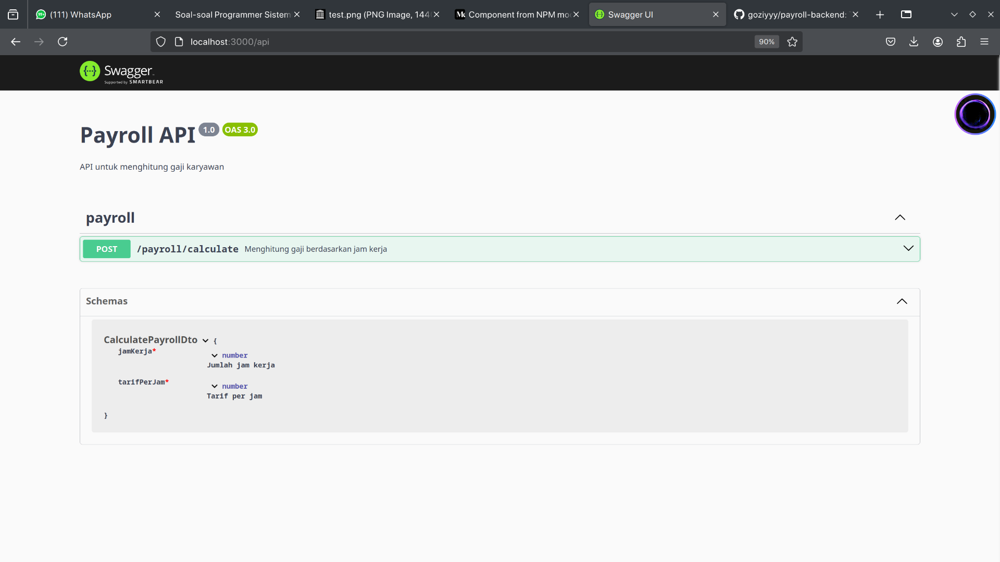
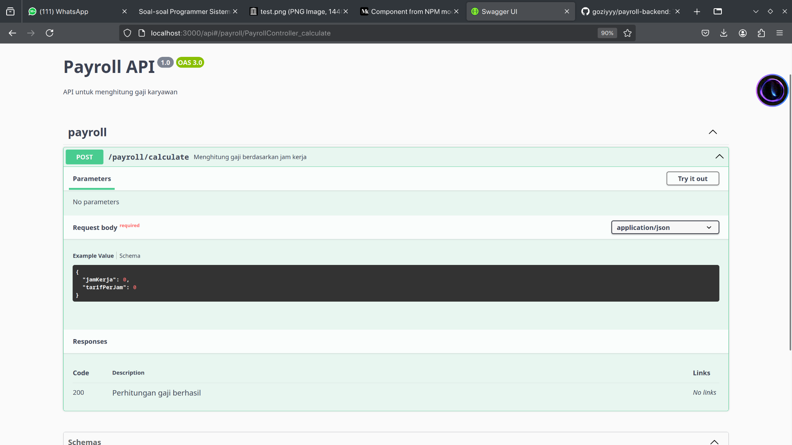
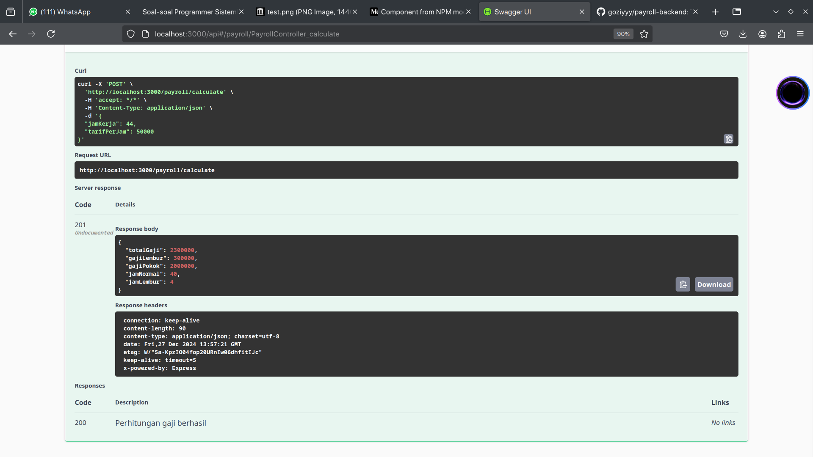

<<<<<<< HEAD
# payroll-backend
Test PT. Idemu Sistem Sinergi
=======
# API Penggajian

Ini adalah API penggajian yang dibangun dengan NestJS dan didokumentasikan dengan OpenAPI (Swagger). API ini menghitung gaji karyawan berdasarkan jam kerja dan tarif per jam, termasuk pembayaran lembur untuk jam kerja yang melebihi 40 jam per minggu.

## Fitur

- Menghitung gaji reguler untuk jam kerja hingga 40 jam per minggu.
- Menghitung gaji lembur dengan tarif 1.5 kali lipat dari tarif reguler untuk jam kerja yang melebihi 40 jam per minggu.
- Menggunakan framework NestJS untuk pengembangan backend.
- Menyediakan dokumentasi API menggunakan OpenAPI (Swagger).

## Cara Penggunaan

API mengharapkan input berikut:

-   **hoursWorked**: Jumlah jam kerja karyawan dalam seminggu.
-   **hourlyRate**: Tarif per jam karyawan.

API akan mengembalikan gaji yang dihitung, termasuk pembayaran lembur jika ada.

## Screenshot

Berikut adalah beberapa screenshot dari proyek ini:

## Struktur Proyek

-   `src/`: Berisi kode sumber untuk aplikasi.
    -   `app.module.ts`: Modul root dari aplikasi.
    -   `app.controller.ts`: Controller utama untuk aplikasi.
    -   `app.service.ts`: Service utama untuk aplikasi.
    -   `payroll/`: Berisi modul, controller, dan service khusus penggajian.
        -   `payroll.module.ts`: Modul penggajian.
        -   `payroll.controller.ts`: Controller penggajian.
        -   `payroll.service.ts`: Service penggajian.
        -   `dto/`: Berisi data transfer object.
            -   `calculate-payroll.dto.ts`: Mendefinisikan struktur untuk permintaan perhitungan gaji.
        -   `interfaces/`: Berisi interface.
            -   `payroll-result.interface.ts`: Mendefinisikan struktur untuk hasil perhitungan gaji.
-   `test/`: Berisi file pengujian untuk aplikasi.

## Teknologi yang Digunakan

-   NestJS
-   TypeScript
-   OpenAPI (Swagger)
>>>>>>> master
